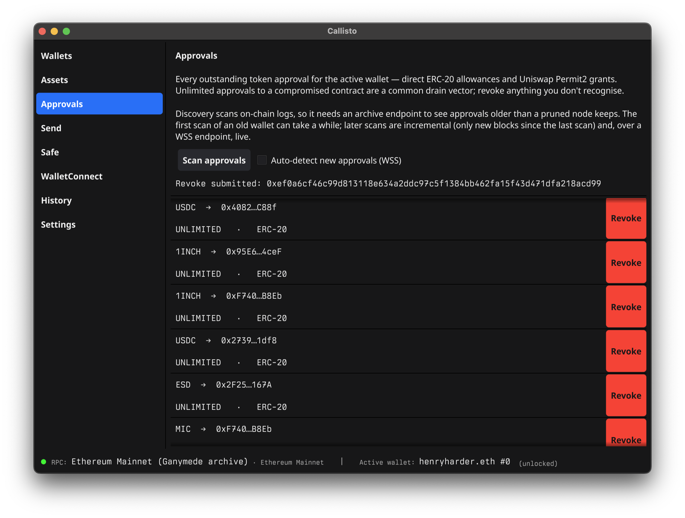
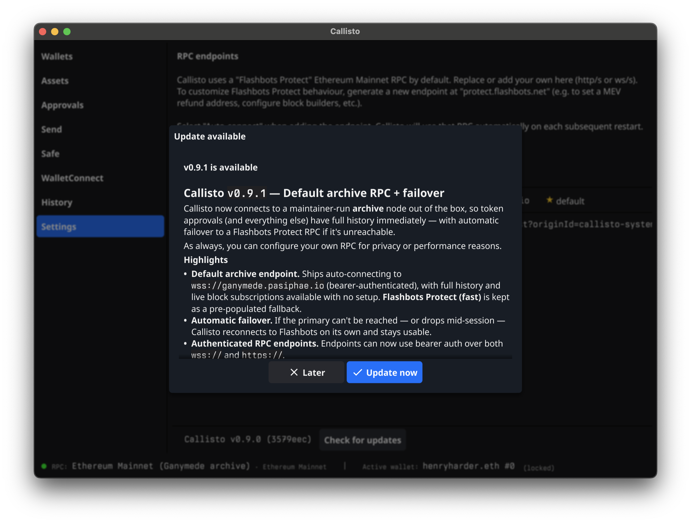

  

<h1 align="left">Callisto</h1>

  <em>A lightweight, powerful, desktop Ethereum wallet management system.</em>

---

Screenshots from Callisto (up to `v0.9.1`) in action.

## Multi-wallet management
_At its core, Callisto is a system designed for those managing multiple wallets and multiple types of signers. Callisto makes using and keeping track of them all easy._

_Callisto can manage hot wallets, hardware signers, and multi-signature wallets._ 

## Adding a keystore (hot) wallet
_While hardware wallets are reccomended, Callisto supports encrypted keystore-based hot-wallets as a convenience feature._

## Full WalletConnect support
_Connect any wallet you manage with Callisto to any web3 application that supports WalletConnect. Callisto supports multiple concurrent WalletConnect sessions._

## In-depth ERC20 approvals management
_View all outstanding ERC20 token approvals that are active for your wallets, and easily revoke old ones or ones that put your account at risk._

## Simple updates
_Easily update Callisto from within the app when a new version is released. For security reasons, there is no automatic update. After reviewing the latest changelog, you can update with a single click._

## Clear visibility at every level
_Get details about the applications you link to Callisto with a WalletConnect session._

_Callisto ensures full visibility into what you are signing._

_Callisto supports ENS forwards and reverse resolution for additional details on address and contract interactions._

## Balances auto-populate, and support custom tokens.
_Callisto scans for Ether and token balances automatically and populates a holdings list._

