

  

<h1 align="left">Callisto</h1>

  <em>A lightweight, powerful, desktop Ethereum wallet management system.</em>

---

Screenshots from Callisto (`v0.15.0`) in action.

## Multi-wallet management
_At its core, Callisto is a system designed for those managing multiple wallets and multiple types of signers. Callisto makes using and keeping track of them all easy._

_Callisto can manage hot wallets, hardware signers, watch-only addresses, and Safe multisig accounts — all from one interface._

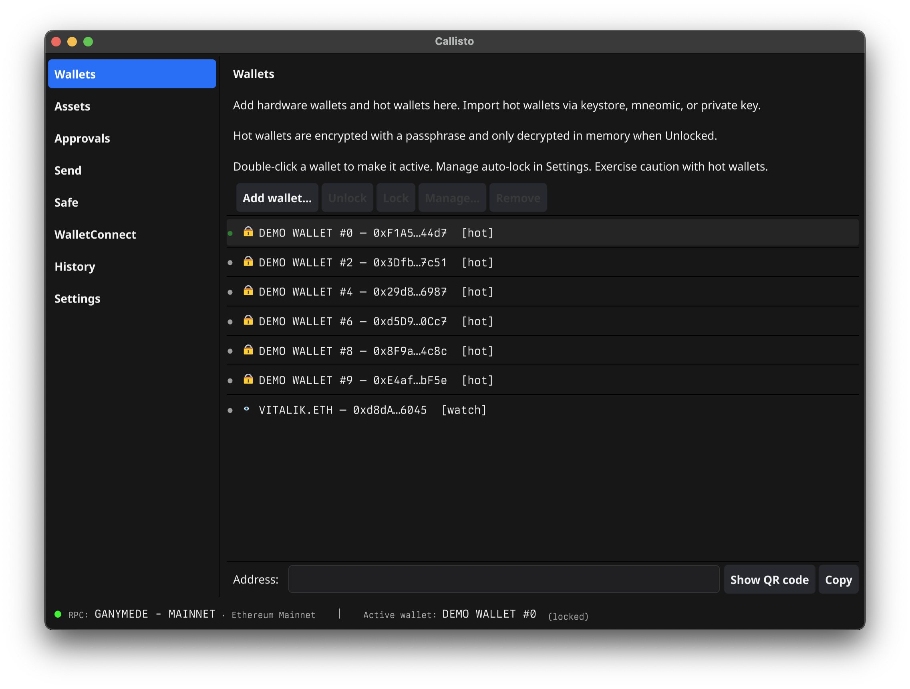

## Adding a keystore (hot) wallet
_While hardware wallets are recommended, Callisto supports encrypted keystore-based hot wallets as a convenience feature. Import a seed phrase once; from then on it unlocks with just a passphrase._

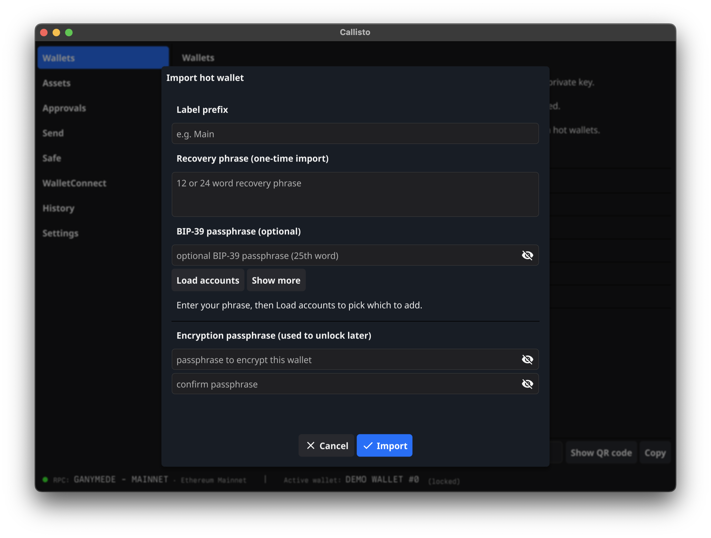

## Bring your own node — or switch chains in one click
_Callisto connects to an Ethereum archive node by default and falls over to Flashbots Protect if it's unreachable. Switch to any major L2 — Base, Arbitrum, Optimism, Polygon, zkSync Era, BNB Smart Chain — with a default public RPC already wired up._

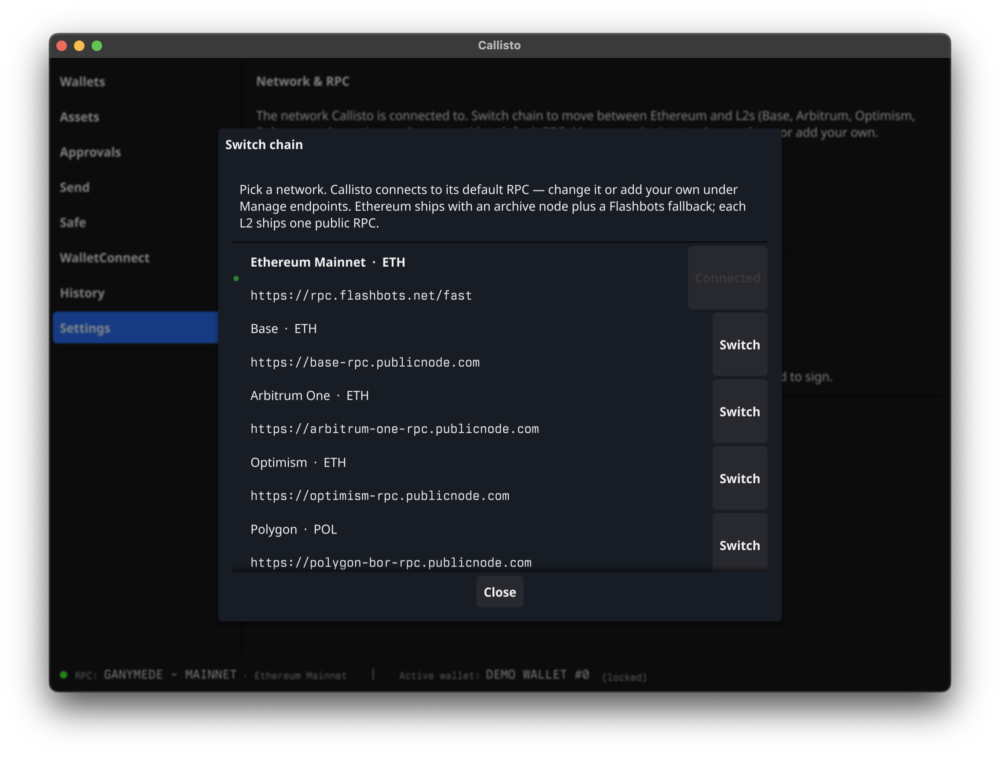

## Touch ID unlock
_On macOS, unlock a hot wallet with Touch ID instead of typing a passphrase every time — enforced with an explicit biometric check, not just an OS keychain flag._

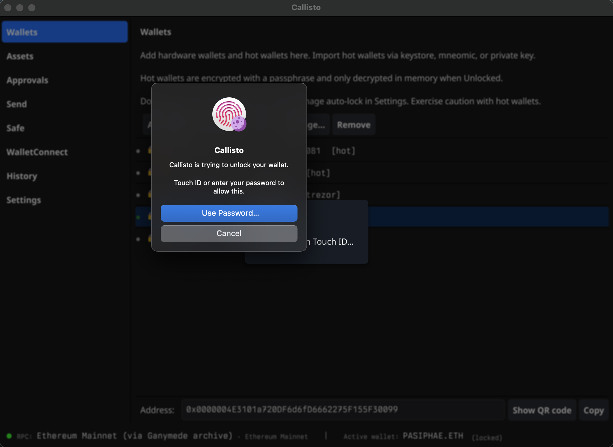

## Gnosis Safe multisig
_Import an existing Safe by address and manage it from a dedicated tab — no external Safe transaction service required. Propose transfers or owner/threshold changes, collect signatures from owners (hot, Ledger, or Trezor) switching in locally, then execute once the threshold is met._

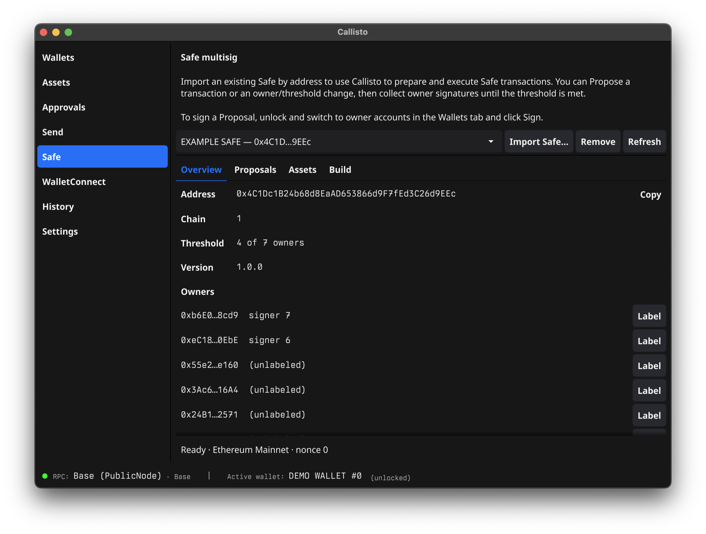

_The Build tab prepares curated ecosystem actions — wrap/unwrap WETH, stake with Lido — as reviewed Safe proposals, batching any required token approval into the same transaction._

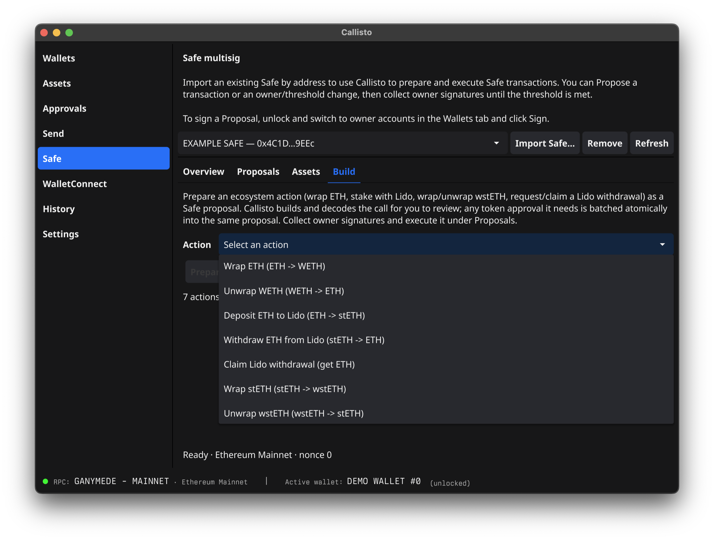

## Full WalletConnect support
_Connect any wallet you manage with Callisto to any web3 application that supports WalletConnect. Callisto supports multiple concurrent WalletConnect sessions._

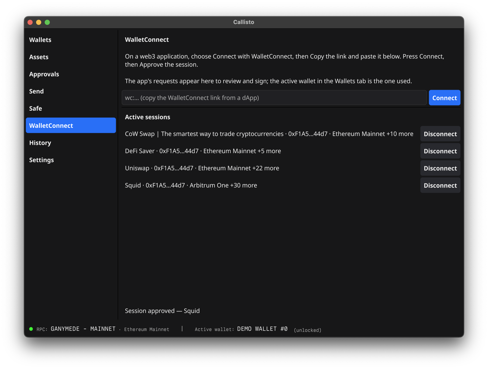

_Every request from a connected dApp — a signature or a transaction — gets the same reviewed, human-readable treatment before you approve it._

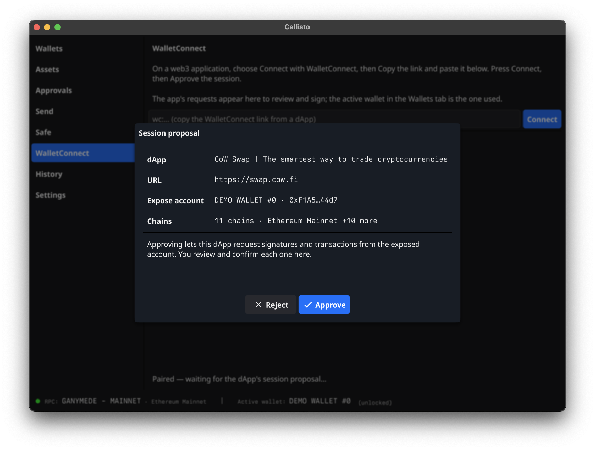

## In-depth ERC20 approvals management
_View all outstanding ERC20 token approvals that are active for your wallets, and easily revoke old ones or ones that put your account at risk._

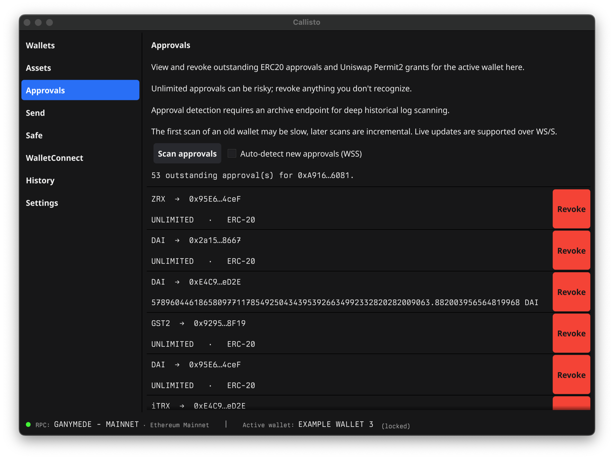

## Clear visibility at every level
_Callisto ensures full visibility into what you are signing — decoded calldata, not raw bytes._

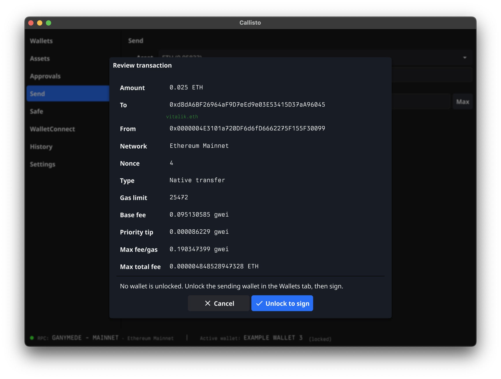

## Receive with a scannable QR code
_Pull up a QR code for any wallet's address straight from the detail view._

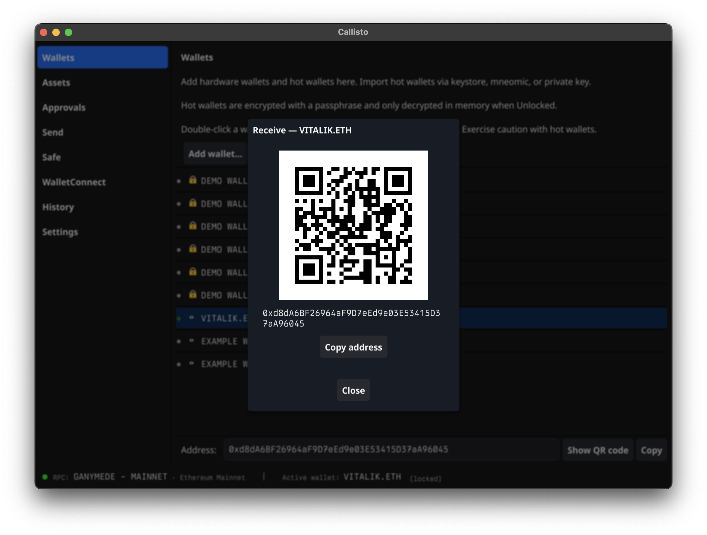

## Balances auto-populate, and support custom tokens
_Callisto scans for Ether and token balances automatically and populates a holdings list — batched into a single Multicall3 read to stay light on public endpoints. Hide spam tokens, or add one by address._

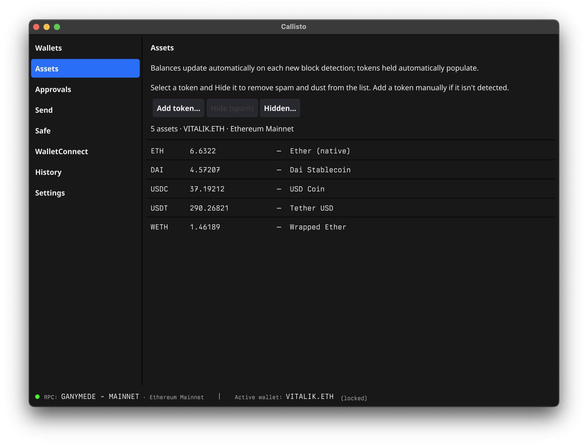

## Simple updates
_Easily update Callisto from within the app when a new version is released. For security reasons, there is no automatic update. After reviewing the latest changelog, you can update with a single click._

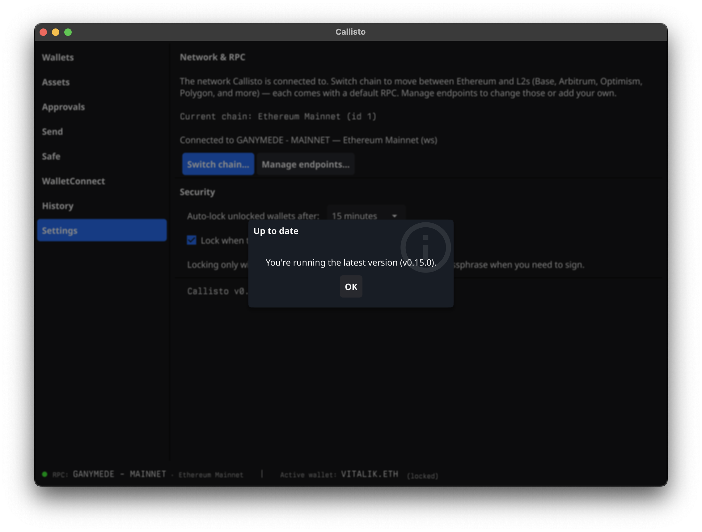
