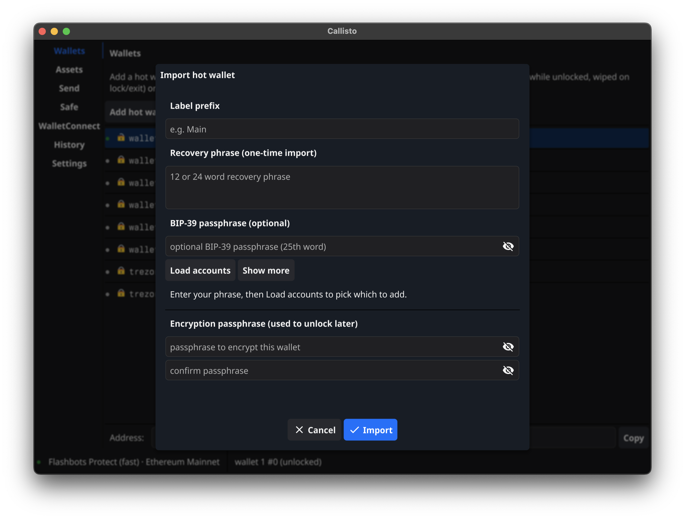
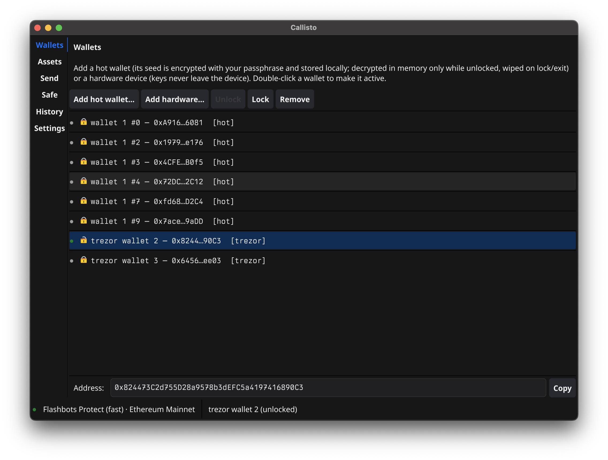
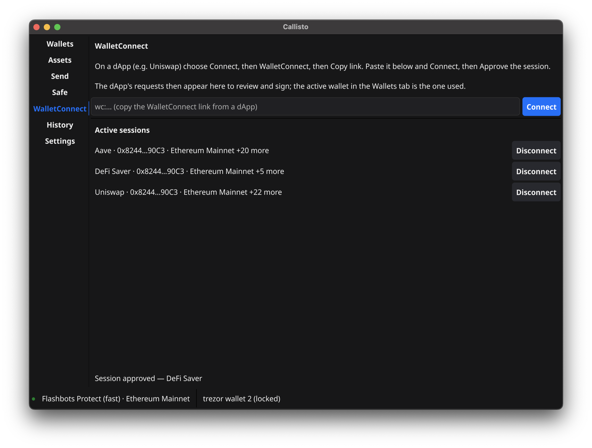
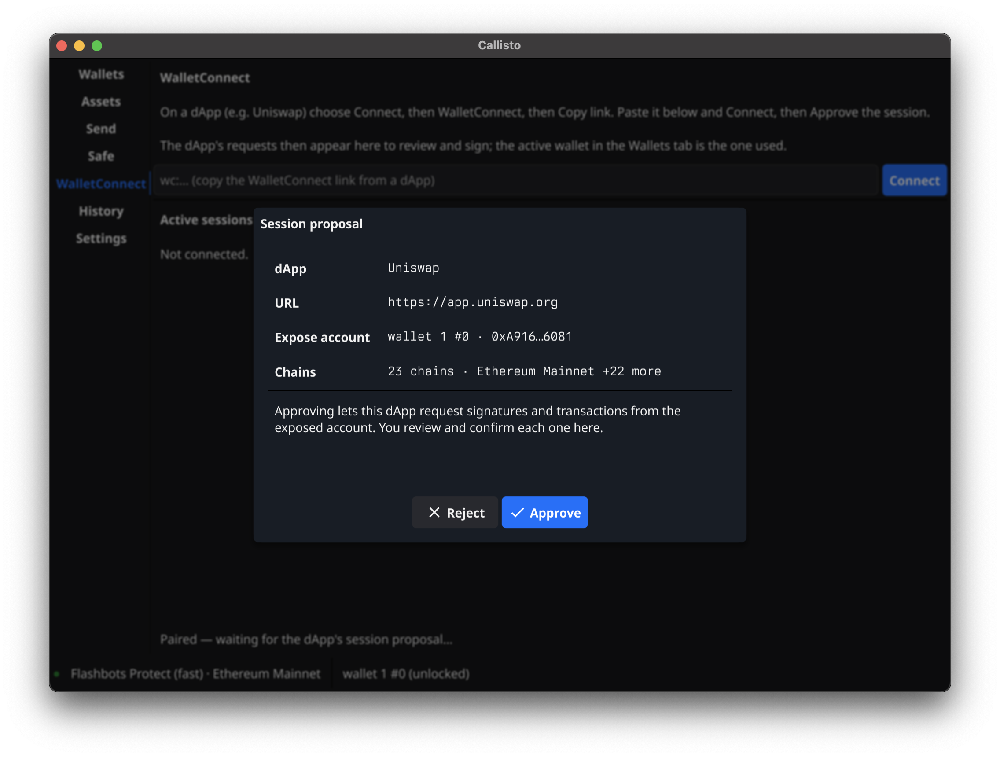
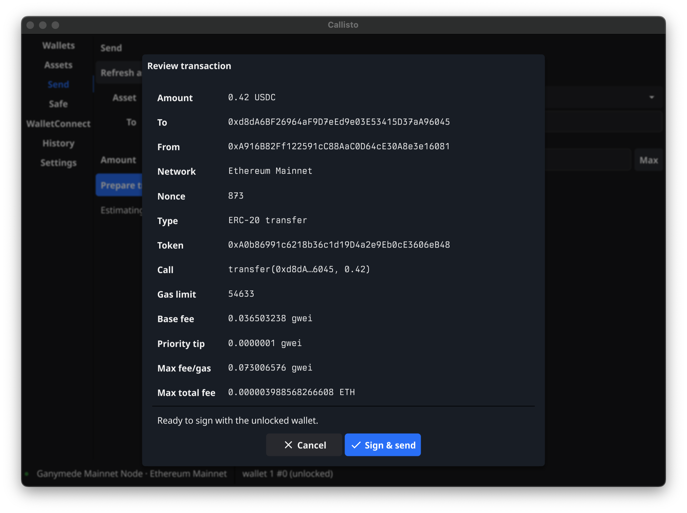
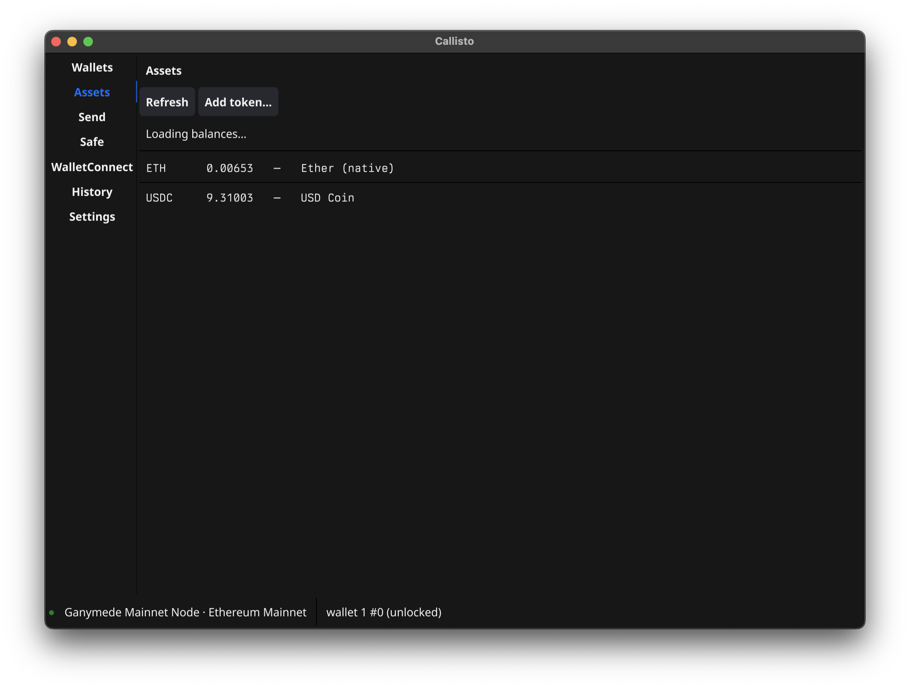

  

<h1 align="left">Callisto</h1>

  <em>A lightweight, powerful, desktop Ethereum wallet management and signing utility.</em>

---

Screenshots from Callisto (`v0.5.0-beta`) in action.

## Adding a keystore (hot) wallet
_You really should get a hardware wallet... But of course, Callisto does support hot wallets._

## Multi-wallet management
_Sometimes we have a lot of wallets to wrangle. Some hot, some hardware, some multi-signature. Callisto makes keeping track of them all easy._

## Full WalletConnect support
_Connect any wallet you manage with Callisto to any web3 application that supports WalletConnect. Callisto supports multiple concurrent WalletConnect sessions._

## Clear visibility at every level
_Connect any wallet you manage with Callisto to any web3 application that supports WalletConnect. Callisto supports multiple concurrent WalletConnect sessions._

_Callisto ensures full visibility into what you are signing._

## Balances auto-populate, and support custom tokens.
_Callisto ensures full visibility into what you are signing._

